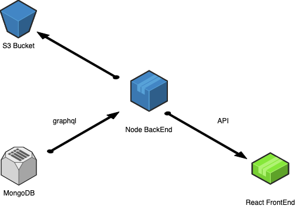

# Medical Records Back End
Medical Records BackEnd (Node)

The intention of this project is to keep a record of medical history for the family

# Architecture

# Initial thougts on API

- /member - General Data for a fmaily member
- /visit - Details of a medical consultation
- /history - List of visits corresponding to a member

